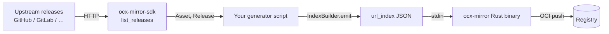

# Generator flow

A generator is a Python script. The SDK and the `ocx-mirror` binary
together form a tiny pipeline:

## Where the SDK ends

Everything upstream of the JSON document is the SDK's job:

- Authenticated fetching with rate-limit-aware retries (`list_releases`).
- Disk caching to make repeat runs cheap (`FileCache`).
- Filtering prereleases / drafts (`include_prereleases=`, `include_drafts=`).
- URL extraction from prose-only release notes (`extract_urls`).
- Typed builder for the wire format (`IndexBuilder`).
- One uniform exception hierarchy (`OcxMirrorError` and subclasses).

## Where your generator begins

Your code answers four questions that the SDK can't:

1. **Which upstream**? The `(owner, repo)` pair, or another source entirely.
2. **Which versions belong in the mirror**? Filter logic — stable only,
   semver constraints, embargo lists.
3. **Which assets**? Asset-name regex, platform whitelist, post-processing.
4. **What's the wire version string**? Strip `v`, drop suffixes, format
   for the downstream registry.

The [first generator](../getting-started/first-generator.md) and
[recipes](../recipes/index.md) show this in practice.
